::: {style="margin-top: 100px;"}
## MDKI Technische Aspekte (Gruppe 4)

### Erste Sitzung: Einführung und Gruppeneinteilung

 
 

**Jula Lühring** 

{width="600"}

:::

## Der Ablauf der heutigen Sitzung

1. [Vorstellungsrunde](#vorstellungsrunde)
2. [Organisatorisches](#organisatorisches)
3. [Erwartungen und Bewertungskriterien](#erwartungen-an-sie)
4. [Nutzung von KI](#nutzung-von-ki)
5. [Beispielprojekt](#beispielprojekt)
6. [Gruppeneinteilung](#gruppeneinteilung)

# Vorstellungsrunde {#vorstellungsrunde}

## Zu mir

::: columns

::: {.column width="50%"}
-  PhD / Postdoc in Computational Social Science 

-  Fokus auf Forschung zu sozialen Medien und digitaler Demokratie 

-  Erforsche Empfehlungsalgorithmen und benutze ML in der Forschung

:::

::: {.column width="50%"}

{width="300"}

[jula.luehring\@uni-graz.at](mailto:jula.luehring@uni-graz.at)

[\@julaluehring.bsky.social](https://bsky.app/profile/julaluehring.bsky.social)

[julaluehring.github.io](https://julaluehring.github.io/)

:::

:::

## Mein akademischer Hintergrund

::: {style="position: absolute; bottom: 0px; right: 0px;"}
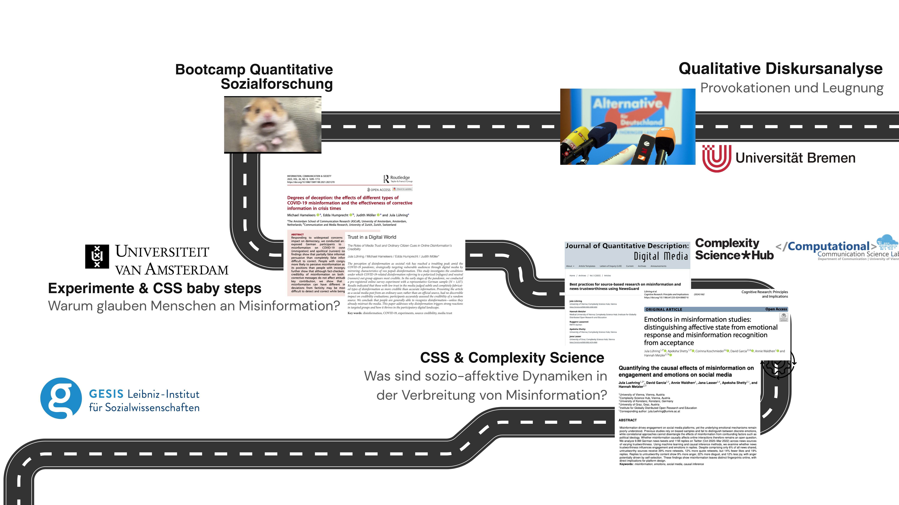{width="4000"}
:::

::: notes
- my background is not very linear, started out with qualitative research, then had to learn quantitative methods before applying them during my Msc

- during that time, I became interested in disordered discourses and entire communities becoming locked into belief systems that disconnect people from any shared standard of reality

- before my PhD, I started wondering a bit about the role of platforms and so that's where CSS and CS came into the picture

- and so thats why I started my PhD with this group of people in a project that studies socio-affective dynamics in misinformation spread online

:::

## Und jetzt Sie!

-   Wie ist Ihr akademischer Hintergrund? 

-   Was fanden Sie am MDKI interessant?

# Organisatorisches {#organisatorisches}

## Kursablauf

::: columns

::: {.column width="60%"}

::: {style="font-size: 0.9em;"}

**1. Termin: 04.03.2026, 9 - 13 Uhr**

:::

::: {style="font-size: 0.7em;"}

* Kurze Einleitung und Kennenlernen

* Gruppeneinteilungen

:::

::: {style="font-size: 0.9em;"}

**2. Termin: 23.04.2026, 9 - 13 Uhr**

:::

::: {style="font-size: 0.7em;"}
* Besprechung der Projektideen
* Klärung von Problemen und Fragen

:::

::: {style="font-size: 0.9em;"}
**3. Termin: 17.06.2026, 9 - 13 Uhr**
:::

::: {style="font-size: 0.7em;"}
* Abschlusspräsentationen!

:::

:::

::: {.column width="40%"}

::: {style="font-size: 0.8em;"}

 
 

  
Sprechstunden-Termine zur begleitenden Projekt-Betreuung werden **nach Bedarf1** vereinbart!

::: 

:::

:::

::: footer

1 Melden Sie sich gerne: [jula.luehring@uni-graz.at](mailto:jula.luehring@uni-graz.at) 

:::

## Kommunikation via Moodle
::: {.r-stack}
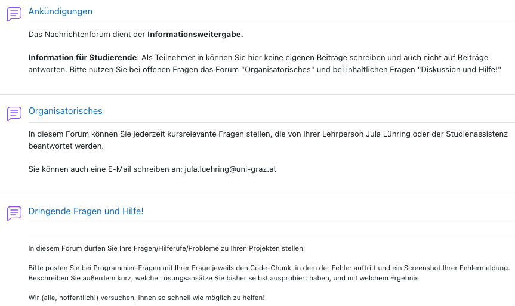{width="3000"}

::: {.fragment .fade-in fragment-index=0}

  
**Bitten nutzen Sie diese Foren!**

:::
:::

# Erwartungen an Sie {#erwartungen-an-sie}
Die folgenden Informationen finden Sie nach der Sitzung auch auf Moodle!

## Grundsätzliches
::: {.r-stack}
::: {.fragment .fade-out fragment-index=0}

Die Gesamtnote setzt sich aus zwei Teilen zusammen:

::: columns

::: {.column width="50%"}

40% werden für die *Anwesenheit* sowie die *nachweisliche Mitarbeit in der Gruppe und in den Sitzungen* vergeben sowie

**$\rightarrow$ individuelle Bewertung**

:::

::: {.column width="50%"}

60% für die *inhaltliche Bewertung* der Abschlusspräsentation bzw. des Projektes.

**$\rightarrow$ Gruppenleistung**

:::

:::

:::

::: {.fragment .fade-in fragment-index=0}

**Don't be this person!**

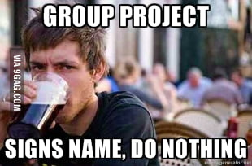{width="300"}

:::

::: 

## Bewertungskriterien der Abschlusspräsentation

::: {.r-stack}

::: {.fragment .fade-out fragment-index=1}

::: {style="font-size: 0.8em;"}
1) **Motivation**
    - Klare Forschungsfrage oder Problembeschreibung
    - Inwiefern ist dies relevant?
    - Gibt es vorherige Forschungsarbeiten?
2) **Methoden- und Datenbeschreibung**
    - Welcher Machine Learning / KI-Ansatz wurde gewählt und wie steht er im Zusammenhang mit der Forschungsfrage?
    - Dokumentation und Begründung der Hyperparameter-Auswahl
    - Woher stammen die Daten? Deskriptive Statistiken, Schritte zur Datenbereinigung
    
:::

:::

::: {.fragment .fade-in fragment-index=1}

::: {style="font-size: 0.8em;"}

3) **Analyse**
    - Kritische Beurteilung der Performance (Accuracy, F1, Silhouette score etc.)
    - Analyse der Ergebnisse zur Beantwortung der Frage
4) **Fazit**
    - Werden die Ergebnisse in Bezug zur Forschungsfrage gesetzt?
    - Welche Einschränkungen / potenziellen Probleme hat der Ansatz?
    
:::

:::

::: {.fragment .fade-in fragment-index=2}

::: {style="border: 2px solid #2A76DD; padding: 20px; background: white;"}
**Im Zweifel:** Fragen Sie gerne oder schauen Sie sich an, wie Forschende diese Aspekte in wissenschaftlichen Fachzeitschriften angehen.
:::

:::

:::

# Nutzung von KI {#nutzung-von-ki}

## Bitte nutzen, aber erklären!

::: columns

::: {.column width="60%"}
Sie dürfen ausdrücklich KI verwenden!

**Aber:** Geben Sie an, welches Modell Sie für wofür verwendet haben und wie gut das funktioniert hat. 

 

Sie sollten jeden durch KI generierten Teil (ob Text oder Code) verstehen und erklären können! 

:::

::: {.column width="40%"}

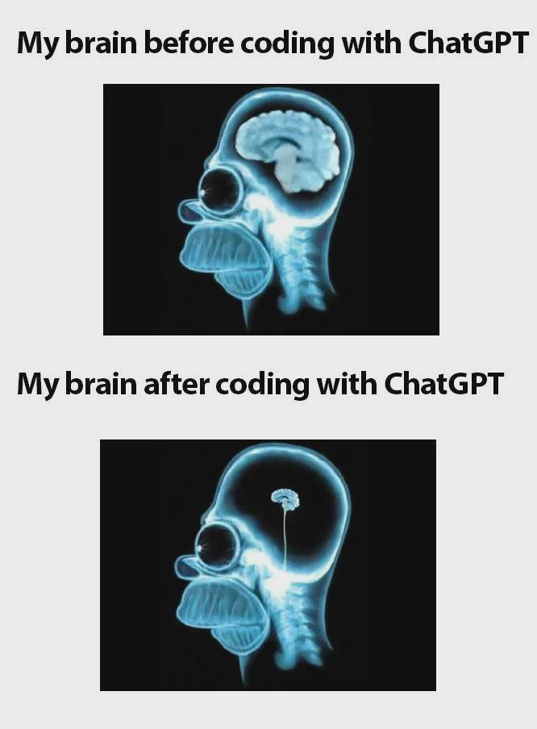{width="500"}
:::

:::

::: notes 
Falls Sie Tipps brauchen, welches Modell für welche Aufgaben geeignet ist und/oder wie man das am besten implementiert, dann lassen Sie es mich gerne wissen und wir können im Forum, in der Einheit oder in einer Sprechstunde darüber diskutieren!
:::

# Beispielprojekte {#beispielprojekte}

## Von vorherigen Studierenden

LLMs in mental health care 
[https://github.com/MGerschuetz/localTherapy](https://github.com/MGerschuetz/localTherapy)

AI for Energy Intelligence
[https://github.com/AlFredFooX/AI4EnergyIntelligence](https://github.com/AlFredFooX/AI4EnergyIntelligence)

## Aus meiner Forschung: Datensammlung, ML und Validierung

::: {.fragment .fade-in fragment-index=0}
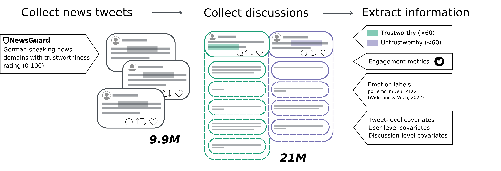{width="20000"}
:::

::: {.fragment .fade-in fragment-index=1 style="position: absolute; bottom: 0px; left: 0; right: 0;"}

::: columns

::: {.column width="50%"}

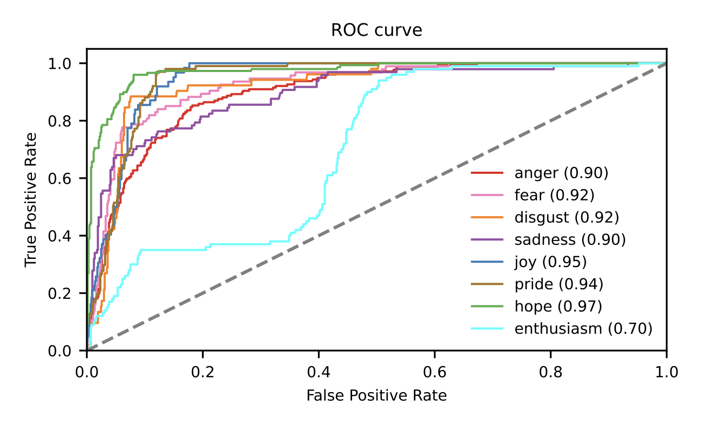{fig-align="right" width="500"}

:::

::: {.column width="50%"}

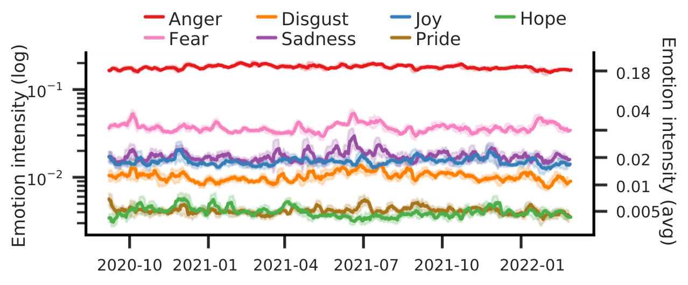{fig-align="right" width="500"}

:::

:::

:::

::: notes
So, we derived 2 major objectives:

- First, we wanted to collect a systematic, large-scale and long-term dataset that relies on continuous trustworthiness ratings for sources, including biased but relatively trustworthy sources so that it reflects the whole spectrum of news trustworthiness

- Second, we tried a matching approach to approximate causal inference so that we could isolate the effects of untrustworthy sources

- We collected data using a source-based approach, collecting all tweets mentioning a news source and the following discussions

- Then we used an existing emotion classifier to label emotions
:::

## Non-parametric matching 

::: columns

::: {.column width="40%"}

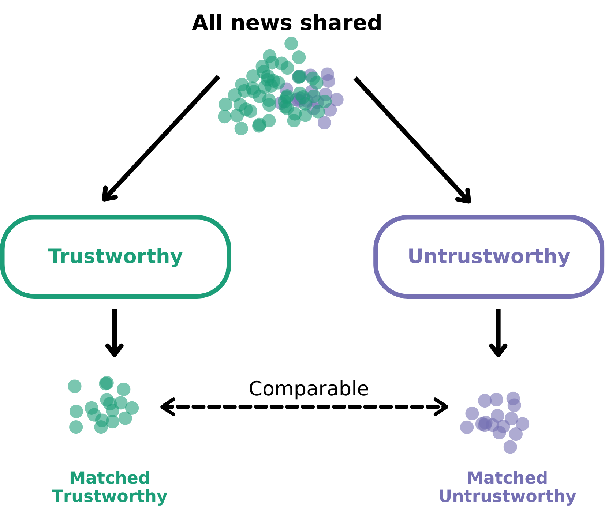{width="500"} 
:::

::: {.column width="60%"}

::: {.r-stack}

::: {.fragment .fade-out fragment-index=0}
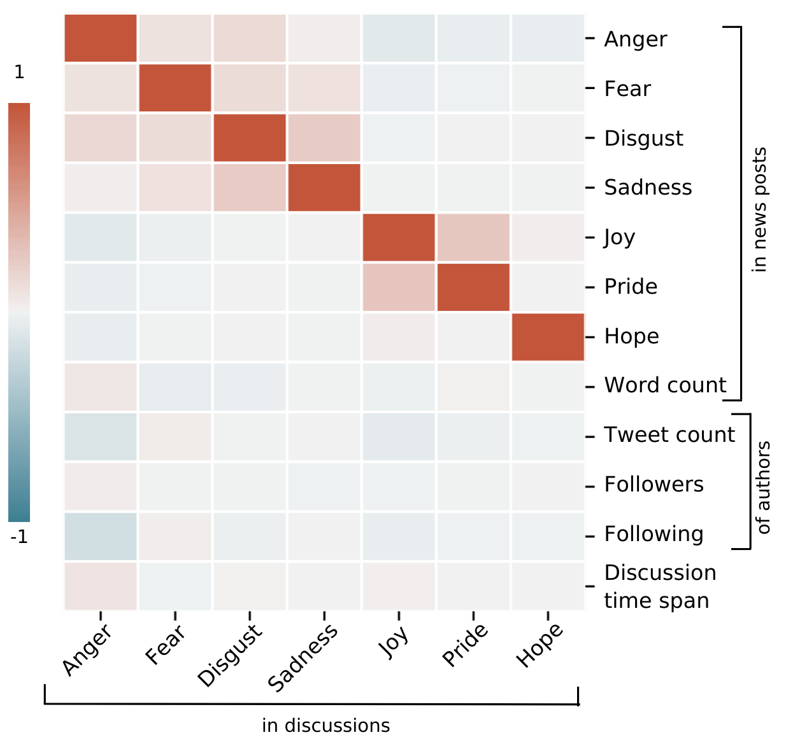{width="450"}
:::

::: {.fragment .fade-in fragment-index=0}

::: {style="text-align: right; font-size: 0.6em;"}
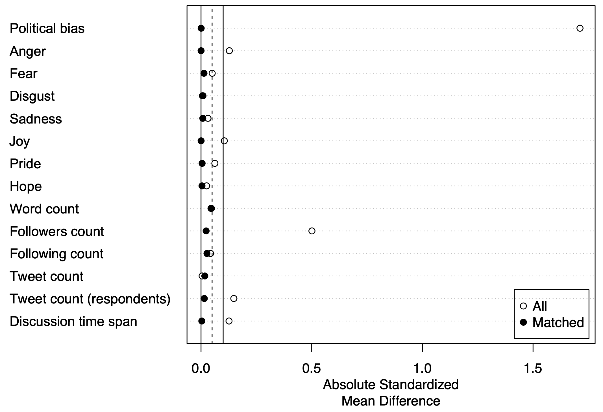{fig-align="right" width="600"}

$\rightarrow$ Matching-Algorithmus **reduziert** emotionale Ansteckungseffekte

:::
:::

:::
:::

:::

::: footer
Ho et al., [2007](https://www.cambridge.org/core/journals/political-analysis/article/matching-as-nonparametric-preprocessing-for-reducing-model-dependence-in-parametric-causal-inference/4D7E6D07C9727F5A604E5C9FCCA2DD21)
:::

::: notes
So now that we have this population of news shared, we can split it into two buckets or conditions
Then, for every news in the untrustworthy bucket, we find a comparable case in the other bucket 
Comparable based on a set of confounders, for instance, emotions in the news post (heatmap)
The SMD has gone to 0 so the matching mitigates emotional carryover effects
This is great because we can study misinformation in the wild while blocking backdoor paths

:::

## Effekte auf Engagement

::: columns

::: {.column width="75%"}
 
 

::: {style="text-align: left; font-size: 0.6em;"}
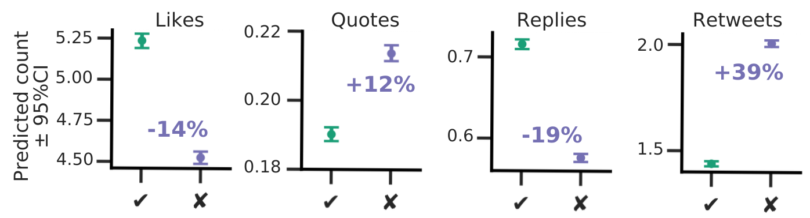{width="1200"}
:::

:::

::: {.column width="25%"}
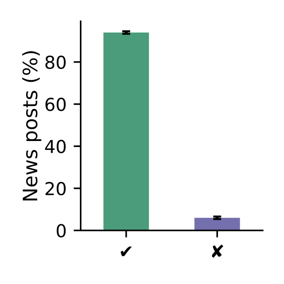{width="175"}

:::

* **Limitiertes Problem**: nur 6% sind unglaubwürdige Nachrichten, die aber 39% mehr Retweets & 12% Quote Retweets generieren

:::

::: footer
Zeileis et al., [2008](http://www.jstatsoft.org/v27/i08/)
:::

## Effekte auf Emotionen in Diskussionen

 

::: columns

::: {.column width="60%"}

::: {style="text-align: left; font-size: 0.6em;"}
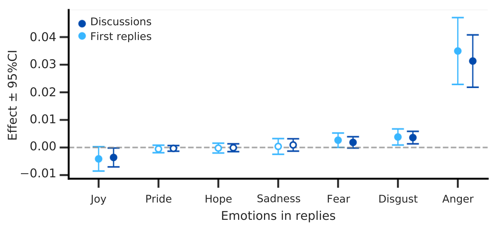{fig-align="left" width="600"}
:::

:::

::: {.column width="40%"}

::: {style="font-size: 0.8em;"}
* **Negative emotionale Spuren**: mehr Wut, Ekel, Angst und weniger Freude
:::

:::

:::

* **Selbstselektion**: wütendere User*innen reagieren, was möglicherweise zu selbstverstärkenden Prozessen führt

# Gruppeneinteilung {#gruppeneinteilung}

## Denken Sie an die Vorlesung
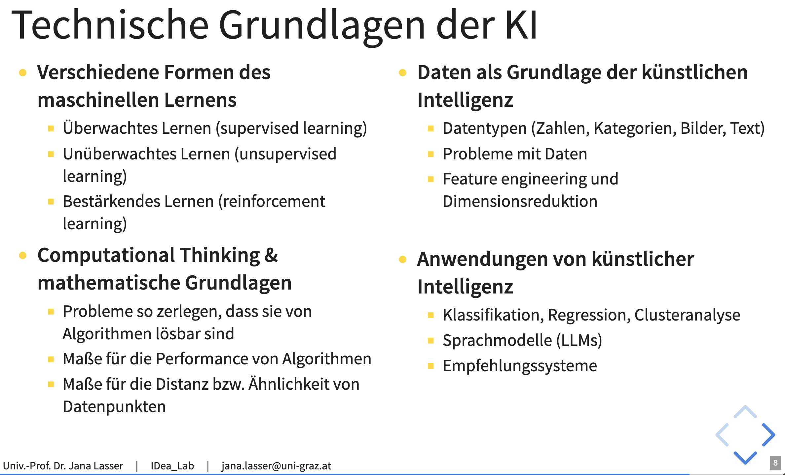

## Sie sind dran! Runde I 

1. Brainstormen Sie in Gruppen Projektideen und tragen Sie Ihre Ideen [HIER](https://docs.google.com/spreadsheets/d/1isMNLzTf560_s19Ytz4jqBA9gY5MJRrNaKJcbhhUpac/edit?usp=sharing) ein.

2. Nach zwei Runden stellt jeweils eine Person eine Idee im Plenum vor (ca. 2 Minuten + Verständnisfragen),

3. woraufhin Sie sich den Projekten zuteilen (Prio #1 und #2).

  

**Endziel der Sitzung:** Jede Person ist in einer Gruppe und jede Gruppe hat 3-5 Mitglieder!

::: notes

- Breakoutrooms mit je 4-5 Personen, um 20 Minuten Projektideen zu brainstormen und im Google Doc einzutragen
- Danch werden die Räume gemischt und es gibt eine zweite Runde
- Im Plenum erklären die verantwortlichen Personen kurz (in 2 Minuten) das Projekt, Fragen sind erlaubt. 
- Nun haben die Studierenden ca. 15 Minuten, um sich selbst einem Projekt zuzuordnen indem sie erste oder zweite Priorität angeben 
- 15 Minuten Pause! Währenddessen einmal schauen, ob Gruppen 3-5 Teilnehmende haben; falls mehr ggf aufsplitten
- Besprechung. Endziel der Sitzung

:::

## Welche Probleme gibt es?
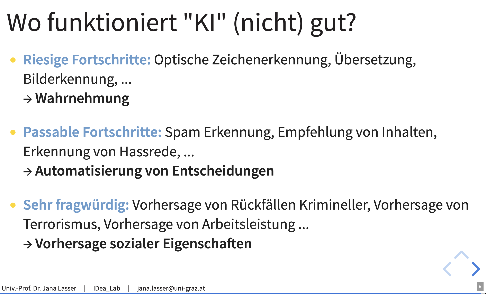

## Sie sind dran! Runde II 

1. Brainstormen Sie in Gruppen Projektideen und tragen Sie Ihre Ideen [HIER](https://docs.google.com/spreadsheets/d/1isMNLzTf560_s19Ytz4jqBA9gY5MJRrNaKJcbhhUpac/edit?usp=sharing) ein.

2. Nach zwei Runden stellt jeweils eine Person eine Idee im Plenum vor (ca. 2 Minuten + Verständnisfragen),

3. woraufhin Sie sich den Projekten zuteilen (Prio #1 und #2).

  

**Endziel der Sitzung:** Jede Person ist in einer Gruppe und jede Gruppe hat 3-5 Mitglieder!

::: notes

- Breakoutrooms mit je 4-5 Personen, um 20 Minuten Projektideen zu brainstormen und im Google Doc einzutragen
- Danch werden die Räume gemischt und es gibt eine zweite Runde
- Im Plenum erklären die verantwortlichen Personen kurz (in 2 Minuten) das Projekt, Fragen sind erlaubt. 
- Nun haben die Studierenden ca. 15 Minuten, um sich selbst einem Projekt zuzuordnen indem sie erste oder zweite Priorität angeben 
- 15 Minuten Pause! Währenddessen einmal schauen, ob Gruppen 3-5 Teilnehmende haben; falls mehr ggf aufsplitten
- Besprechung. Endziel der Sitzung

:::

## Gruppenorganisation

* Wie kommunizieren Sie untereinander? Moodle-Forum, Email, Messenger,...

* Wann treffen Sie sich das nächste Mal?

* Können Sie bis dahin Aufgaben verteilen? 

Sie sind unzufrieden mit dem Thema oder haben andere interne Probleme? Dann melden Sie sich bei per Email bei mir. 

## Wie geht's weiter bis zur nächsten Einheit? 

1. Überlegen Sie sich eine Fragestellung.

2. Welche Methodik können Sie verwenden? Wo bekommen Sie die passenden Daten her? 

Machen Sie einen Termin mit mir aus für die Woche vor Ostern (23.-27.3.)!

# Fragen? 
Falls nicht: vielen Dank und einen schönen Tag!
