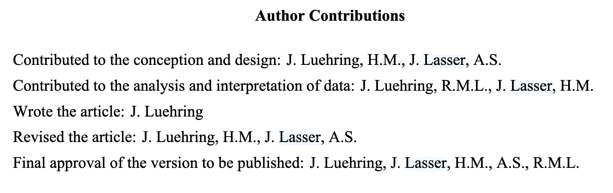
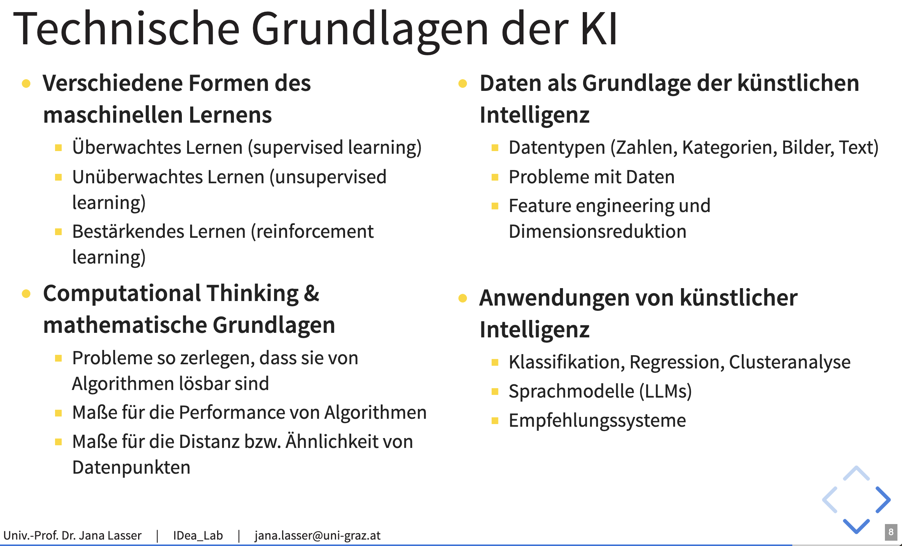
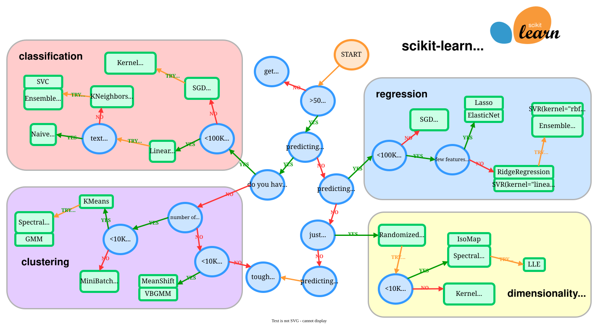
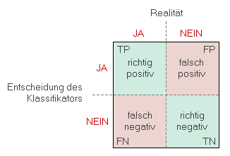
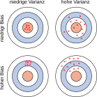

::: {style="margin-top: 100px;"}
## MDKI Technische Aspekte (Gruppe 4)

### Zweite Sitzung: Besprechung der Projektideen

 
 

**Jula Lühring** 

{width="600"}

:::

## Der Ablauf der heutigen Sitzung

1. [Wiederholung: Organisatorisches](#organisatorisches)
2. [Wiederholung: Erwartungen und Bewertungskriterien](#erwartungen-an-sie)
4. [Refresher: Machine Learning](#machine-learning) 

-- Pause & Fragen -- 

5. [Besprechung der Projektideen](#projektideen)
6. [Gruppenarbeit](#gruppenarbeit)

# Organisatorisches {#organisatorisches}

## Kursablauf

::: columns

::: {.column width="60%"}

::: {style="font-size: 0.9em;"}

**1. Termin: 04.03.2026, 9 - 13 Uhr**

:::

::: {style="font-size: 0.7em;"}

* Kurze Einleitung und Kennenlernen

* Gruppeneinteilungen

:::

::: {style="font-size: 0.9em;"}

**2. Termin: 23.04.2026, 9 - 13 Uhr**

:::

::: {style="font-size: 0.7em;"}
* Besprechung der Projektideen

* Klärung von Problemen und Fragen

:::

::: {style="font-size: 0.9em;"}
**3. Termin: 17.06.2026, 9 - 13 Uhr**
:::

::: {style="font-size: 0.7em;"}
* Abschlusspräsentationen 

:::

:::

::: {.column width="40%"}

::: {style="font-size: 0.8em;"}

 
 

  
Sprechstunden-Termine zur begleitenden Projekt-Betreuung werden **nach Bedarf1** vereinbart!

::: 

:::

:::

::: footer

1 Melden Sie sich gerne: [jula.luehring@uni-graz.at](mailto:jula.luehring@uni-graz.at) 

:::

# Erwartungen an Sie {#erwartungen-an-sie}

Alle Infos finden Sie auch auf Moodle!

## Bewertungskriterien der Abschlusspräsentation (und Projekte)

::: {.r-stack}

::: {.fragment .fade-out fragment-index=1}

::: {style="font-size: 0.8em;"}
1) **Motivation**

    - Klare Forschungsfrage oder Problembeschreibung
    - Inwiefern ist dies relevant?
    - Gibt es vorherige Forschungsarbeiten?
    
2) **Methoden- und Datenbeschreibung**

    - Woher stammen die Daten? Deskriptive Statistiken, Schritte zur Datenbereinigung
    - Welcher Machine Learning / KI-Ansatz wurde gewählt und wie steht er im Zusammenhang mit der Forschungsfrage?
    - Dokumentation und Begründung der Hyperparameter-Auswahl
    
:::

:::

::: {.fragment .fade-in fragment-index=1}

::: {style="font-size: 0.8em;"}

3) **Analyse**

    - Kritische Beurteilung der Performance (Accuracy, F1, Silhouette score etc.)
    - Analyse der Ergebnisse zur Beantwortung der Frage
    
4) **Fazit**

    - Werden die Ergebnisse in Bezug zur Forschungsfrage gesetzt?
    - Welche Einschränkungen / potenziellen Probleme hat der Ansatz?
    
:::

:::

::: {.fragment .fade-in fragment-index=2}

::: {style="border: 2px solid #2A76DD; padding: 20px; background: white;"}
**Im Zweifel:** Fragen Sie gerne oder schauen Sie sich an, wie Forschende diese Aspekte in wissenschaftlichen Fachzeitschriften angehen.
:::

:::

:::

## Angabe von Mitarbeit

::: columns

::: {.column width="30%"}

::: {style="font-size: 0.8em;"}

  

Ähnlich zu CRediT (Contribution Roles Taxonomy; s. [Wiley](https://authors.wiley.com/author-resources/Journal-Authors/open-access/credit.html)):

:::

:::

::: {.column width="70%"}

:::

:::

Hier könnte das so aussehen:

    1. Konzeptualisierung der Fragestellung und Methodik
    2. Datensammlung und/oder Bereinigung der Daten
    3. Anwendung von Machine Learning 
    4. Evaluierung der Methode
    5. Statistische Analysen
    6. Vorbereitung der Abschlusspräsentation

# Refresher: Machine Learning {#machine-learning}

## Denken Sie an die Vorlesung:

## Unsupervised vs Supervised Machine Learning

- Der große Unterschied: **Trainingsdaten!**

- Haben wir *Ground Truth*, also gelabelte Beispiele für das Training?

| | **Supervised** | **Unsupervised** |
|---|---|---|
| **Labels** | vorhanden | nicht vorhanden |
| **Ziel** | bekannte Muster lernen | unbekannte Muster finden |
| **Beispiel** | Spam-Filter | Themen in Nachrichten |

## Unüberwachtes Lernen / unsupervised learning

::: {style="font-size: 0.75em;"}
*Keine Ground Truth: das Modell findet selbst Struktur in den Daten*
:::

 
**Clustering** = Gruppierung ähnlicher Beobachtungen

- k-Means: teilt Daten in $k$ Gruppen anhand von Distanz
- Hierarchisches Clustering: baut decision trees der Ähnlichkeiten
- Usw. 

## Überwachtes Lernen / supervised learning

::: {style="font-size: 0.75em;"}

*Mit Ground Truth: das Modell lernt aus gelabelten Beispielen.*

:::

* **Klassifikation**: Ausgabe ist eine Klasse (z.B. Spam / kein Spam)
  - Naive Bayes, decision tree, random forest, logistic regresion, usw. 

* **Regression**: Ausgabe ist ein kontinuierlicher Wert (z.B. Preis)
  - Decision tree, random forest, linear regresion, usw. 

> Entscheidend: die Qualität und Balance der Labels!

## Welcher Algorithmus?

* **No Free Lunch Theorem:** Kein Algorithmus ist universell am besten

::: columns

::: {.column width="45%"}

 

* **Faustregel**: mit simplen Modellen starten, Komplexität bei Bedarf erhöhen.

:::

::: {.column width="55%"}

  

:::

:::

## Wie viele Daten? 

  

* **Faustregel**: circa 10× mehr Observationan als Attribute, aber idealerweise mehr.

  - Ansonsten: Komplexität des Modells, Performanz, usw. 
  - Bei kleineren Datensätzen: simplere Modelle, Kross-Validation, usw.
    

* **Grundsätzlich**: ein guter Datensatz > der Algorithmus

*$\rightarrow$ Was macht einen guten Datensatz aus?* 

## Trainingsdaten und Evaluierung 

::: {style="font-size: 0.75em;"}

*Hinweis: Hierbei handelt es sich um die Trainingsphase, nicht um die Anwendung.* 

 
:::

**Overfitting erkennen & vermeiden**

- Train-Test-Split: 80 / 20
- Bei großer Datenmenge: Train-Validate-Test (70 / 10 / 20)

**Underfitting vermeiden**: komplexeres Modell wählen, mehr/bessere Daten, mehr Training

**Class Imbalance vermeiden**: unbedingt Klassenverteilung in Trainingsdaten prüfen!!

## Fehlermatrix & Evaluation

 

::: columns

::: {.column width="55%"}

:::

::: {.column width="40%"}

**Statistische Metriken:** Genauigkeit / Accuracy, Sensitivität / Recall, Spezifizität / Precision, F1-Wert 

:::

:::

$\rightarrow$ *Die Wahl der Metrik hängt von den Erwartungen ab, s. Vorlesung zur Performance*^[[janalasser.at/lectures/MC_KI/VO2_2_performance]( https://janalasser.at/lectures/MC_KI/VO2_2_performance/#/2/2/1)]

## Modellfehler

::: {style="font-size: 0.8em;"}

*Hinweis: Bias und Varianz beschreiben das Modell, nicht die Daten.*

:::

::: columns

::: {.column width="50%"}

:::

::: {.column width="50%"}

**Bias**: systematische Abweichung des Modells von den wahren Werten 

 

**Varianz**: starke Streuung des Modells für ähnliche Werte

:::

:::

# Offene Fragen?
Dann auf zu Moodle!

# 30 Minuten Pause
Danach: kurze Updates aus Ihren Projekten!

# Besprechung der Fragen

# Besprechung der Projektideen {#projektideen}
Sie sind dran!

## Wie geht's weiter bis zur nächsten Einheit? 

1. Ggf. Überarbeitung von Konzeptualisierung 

2. Deskriptive Auswertung & Bereinigung der Daten 

3. Anwendung Ihrer gewählten Methode & Auswertung dessen

4. Analyse zur Beantwortung der Fragestellung

5. Vorbereitung der Abschlusspräsentation

Machen Sie einen Termin mit mir aus zur Zwischenbesprechung!

# Gruppenarbeit {#gruppenarbeit}

Falls nicht: vielen Dank und einen schönen Tag!

